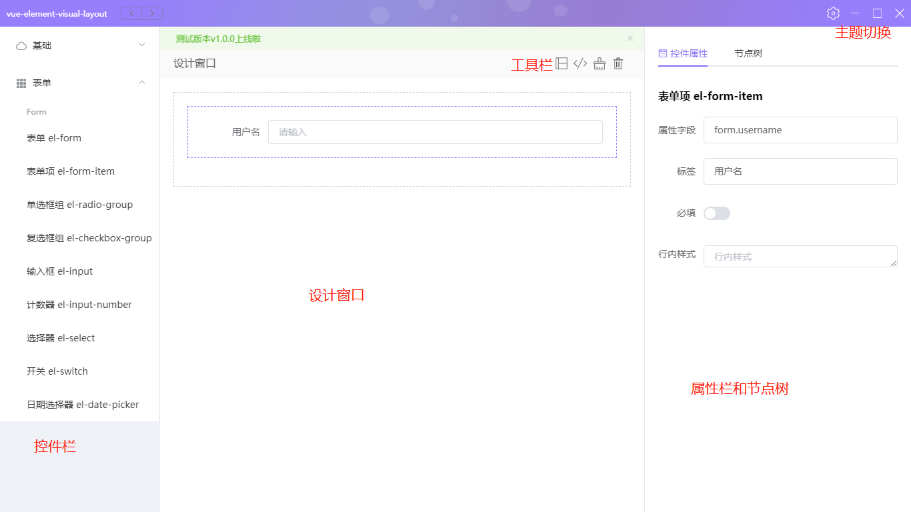
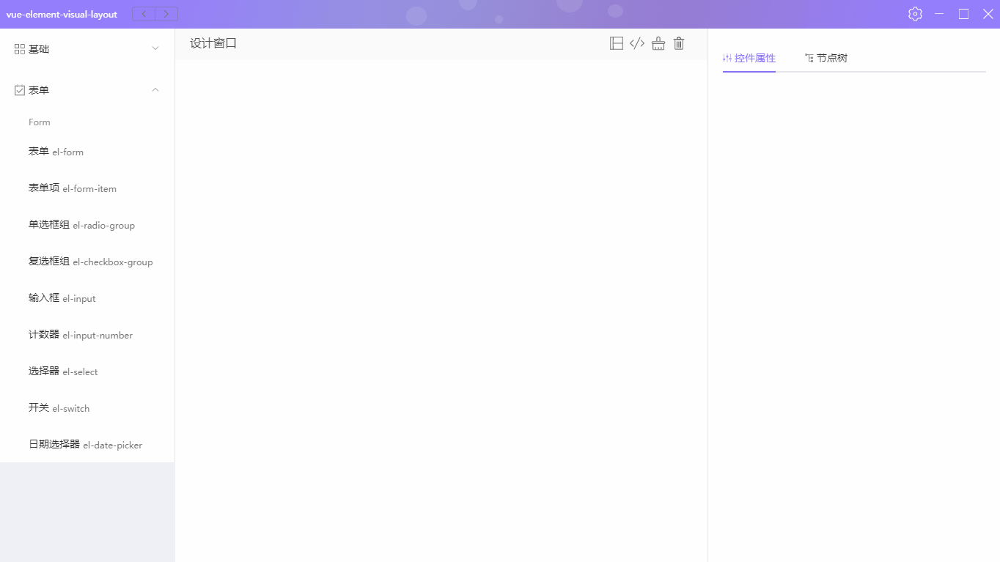

# 欢迎使用 vue-element-visual-layout
**基于vue3 + electron13 + element-plus 开发的可视化拖动布局工具**  
    
## 更新日志
**v1.0.2**
待发布
- 剪切控件快捷键功能（待实现）
- 鼠标移入节点树对应控件高亮(待实现)
- 更多

**v1.0.1**
- 优化左侧控件栏显示
- 打开默认主题色
- 优化部分主题色
- class="el-icon-*"类 全部替换成自定义svg-icon组件
- 修复复制节点生成的id问题

**v1.0.0**
- 栅格布局拖拽
- 表单控件拖拽
- 设计窗口代码分离显示
- 控件单个属性
- 节点树
- 设计边框线
- 控件复制粘贴功能
- 控件删除功能
- 自定义主题

## 界面介绍

  

## 如何使用

**客户端**

[下载地址](https://github.com/shenxingchao/vue-element-visual-layout/releases/tag/v1.0.0)  

**网页版**

[在线使用](https://shenxingchao.github.io/vue-element-visual-layout/#/)

切换到 vue-web 分支
```shell
npm run serve
npm run build
```
```shell
yarn run serve
yarn run build
```

**创建栅格布局**

  

**创建表单**

  

**快捷键**

| 快捷键 | 功能                                                   |
| ------ | ------------------------------------------------------ |
| DELETE | 删除选中控件及其子控件                                 |
| CTRL+C | 复制选中控件                                           |
| CTRL+V | 粘贴复制的控件到选中控件的子控件中或者粘贴到最外层控件 |

**工具栏**

功能按工具栏按钮顺序
- 设计窗口/切换显示边框
- 查看代码
- 清空布局
- 删除选中的控件 DELETE

**拖拽**
- 属性栏切换到节点树选项卡下，拖动节点即可完成控件之间的位置交换
- 左侧控件栏拖到设计窗口时，最外层控件可排序

**主题**
- 右上角设置按钮下可切换界面主题色

## 二次开发
**下载代码**
```git
git clone https://github.com/shenxingchao/vue-element-visual-layout.git
```

**使用npm**
```shell
npm install
npm run electron:serve
npm run electron:build
```

**使用yarn**
```shell
yarn
yarn run electron:serve
yarn run electron:build
```

> 免费使用！！其他有问题的地方欢迎提问，需要其他功能的可以提出来，酌情增加